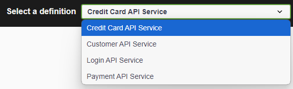
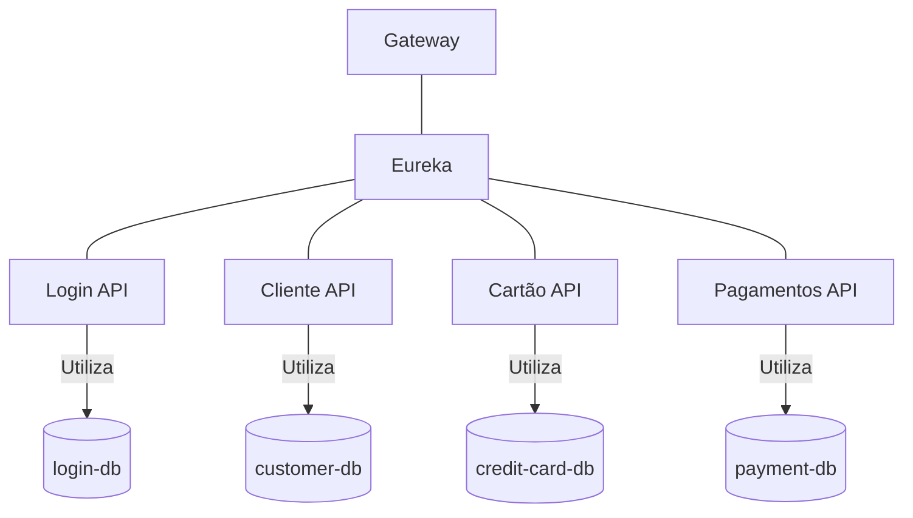

# HACKHATON

## Tecnologias Usadas

- **Java 17**
- **Spring**
- **Maven**
- **PostgreSQL**
- **Docker**
- **Docker Compose**

## Subir APIs

Para iniciar as APIs, utilize o seguinte comando:

```bash
docker compose up --build
```

Este comando é suficiente para executar o projeto. A geração dos arquivos .jar das APIs é feita através de uma imagem do Docker.

Exemplo de imagem que faz o build e coloca em outra imagem:

```docker
# Etapa 1: Compilar a aplicação
FROM maven:3.8.4-openjdk-17 AS build
WORKDIR /app
COPY pom.xml .
COPY src ./src
RUN mvn clean package -DskipTests

# Etapa 2: Criar a imagem final
FROM openjdk:17-jdk-slim
WORKDIR /app
COPY --from=build /app/target/gateway-0.0.1-SNAPSHOT.jar app.jar
ENTRYPOINT ["java", "-jar", "app.jar"]
```

Após subir o docker compose, aguardar pelo menos 1 minuto para que todos as api's se registrem no Eureka.

## Swagger

O swagger se encontra em: http://localhost:8080/swagger-ui.html

No menu superior vai ser exibido a documentação das APIs.



Aqui, a agregação das api-docs estão sendo feitas através do Gateway.
[Link do tutorial](https://medium.com/@erkndmrl/swagger-3-with-spring-cloud-gateway-a-comprehensive-guide-f355459d914a)

## Arquitetura

Todos os serviços se conectam ao Eureka.
E a porta de entrada é o gateway.

Além disso, cada serviço possui seu próprio banco de dados.




## Regras de negócio

1. O usuário ```adj2``` e a senha ```adj@1234``` são criados assim que a API de Login é iniciada. E só é criada uma única vez.
2. A validação do CPF segue a regra da anotação ```org.hibernate.validator.constraints.br.CPF```. Então o CPF deve ser válido. [Link](https://github.com/hibernate/hibernate-validator/blob/main/engine/src/main/java/org/hibernate/validator/constraints/br/CPF.java)
3. A validação do CEP é implementação própria, respeitando o padrão XXXXX-XXX. Exemplo: 54987-098
4. A validação do cartão de crédito é utilizando o algoritmo Luhn. Então o número de cartão também deve ser válido, seguindo as regras do Luhn.
    1. Link da anotação: [CreditCardNumber](https://docs.jboss.org/hibernate/validator/5.1/api/org/hibernate/validator/constraints/CreditCardNumber.html)
    2. Link para gerar cartão de crédio usando o algoritmo Luhn: [dcode](https://www.dcode.fr/luhn-algorithm)
5. A validação do Estado é o nome completo do estado, conforme documentação funcional.
